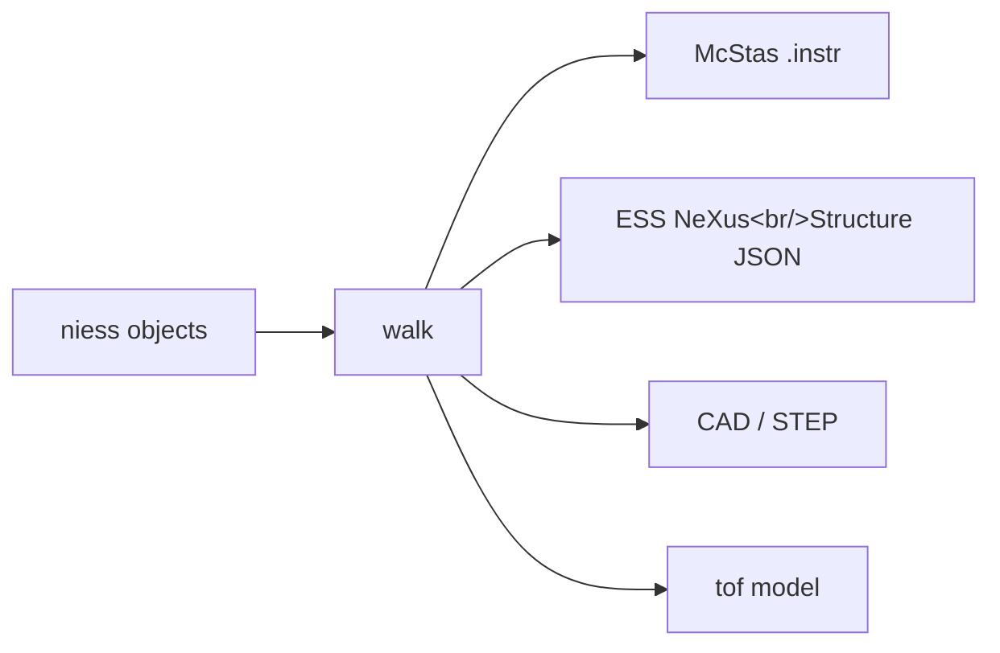

# Core concepts

Five ideas explain most of niess. None of them is large.

## A component is calibration, not geometry

A `Component` holds what was *measured* about a thing — a guide's length and m-values,
a chopper's radius and window — with units attached, as scipp `Variable`s. It knows how
to express itself as a McStas component through one method:

```python
def __mccode__(self) -> tuple[str, dict]:
    return 'Guide_gravity', {'l': self.length.to(unit='m').value, ...}
```

That is the only place units are converted. Everywhere upstream, a length is
`350 * mm` because that is what the drawing says.

## A section is a declaration

A `Section` is an ordered list of typed fields naming the components in beam order.
There is no method to write; the order *is* the information:

```python
class Guides(Section):
    unit_1: StraightGuide
    unit_2: StraightGuide
```

Sections nest. A section without `_flat = True` emits itself as an included
sub-instrument, so the generated McStas mirrors how you think about the beamline
rather than being one flat list.

Fields whose names begin with `_` are per-class extras rather than components — `_flat`
is one — and are ignored by every introspection method, so a section can carry as many
as it needs.

## A calibration is a dictionary

Constructing an instrument means handing it nested plain dictionaries whose keys match
the section field names — matched by name, so their order is free:

```python
Primary.from_calibration(teaching_parameters())
```

A component's position and orientation are its placement in the instrument coordinate
system. Where the geometry is specified as a chain of offsets — as BIFROST's is —
`at_relative` places each element against the one before it, which is what a McStas
`AT (0, 0, d) RELATIVE previous` line does, except computed once rather than typed
repeatedly, so moving something upstream carries everything downstream with it. Where
the coordinates are known independently, write them directly; nothing requires a chain.

`@calibration` lets `from_calibration` accept either one dictionary or keyword
arguments, and `variant_parameters` selects between design variants of a repeated unit.

## Targets read the tree

An instrument is a tree: sections holding components, a tank holding channels holding
arms. One walk visits it, and each target translates what it is handed.



McStas is one of those, not the road to the others. That matters because a target can
only use what it is given, and an assembled McStas instrument is a flat list of
components — so anything McStas cannot say is lost before the other targets see it. The
worked example is a disc chopper whose openings are neither identical nor evenly spaced:
McStas has no way to describe one, so it becomes a `GROUP` of several components, and
putting it back together afterwards took metadata tags that three separate targets ended
up reading. Converting the tree, the disc is a disc.

Reading the tree also classifies more. A window with nothing to say emits as a McStas
`Arm`; an instrument-reading converter sees an `Arm` and files it under
`NXcoordinate_system`, while the tree says `Filter`. For BIFROST that is 22 windows and
9 collimators that are now what they are.

### What the walk gives a translator

**Names.** A component keeps the name it was calibrated with, under whatever contains
it. Sections contribute nothing, so a guide three sections deep is still `unit_29_straight`;
a BIFROST channel contributes `channel_3`, so its filter is
`channel_3_radial_filter_collimator`.

**Frames.** Where a thing is measured from. A frame is a declared node like any other —
it has no size and nothing passes through it, so it is invisible to the flow graph, and
each target renders it as it likes: McStas as an `Arm`, NeXus as a link in a
`depends_on` chain, CAD as a node in the assembly.

**Order and position.** Declaration order is beam order. `visit.path` identifies a node
without borrowing any target's names for it, and `visit.ancestor(Channel).index` answers
"which channel is this in" — where an instrument-reading converter had to match a regex
against a generated `WHEN` clause for the same number.

## What is McStas-shaped stays in the McStas target

Not everything in an emitted instrument is a thing in the beam. BIFROST's tank has 99
coordinate-frame `Arm`s, a per-particle variable saying which channel a neutron was
tagged with, and the `WHEN` and `EXTEND` clauses that read and write it. Those are how
McStas expresses something, not what the instrument is, and they mean nothing to NeXus,
CAD or a chopper-cascade model.

The rule: **if a thing exists in the instrument, it is a niess object; if it exists only
because of how a target models the instrument, it belongs to that target.** A radial
slit bank is a real aperture and is an object. A coordinate frame is real and is a node.
A `secondary_cassette` flag is McStas's bookkeeping and lives in the McStas conversion.

Everything a class contributes to a McStas instrument is written on the class:

| on the class | for |
| --- | --- |
| `__mccode__` | what the thing *is*: one `COMPONENT` line and its parameters |
| `to_mccode` | contributing to the instrument around it — a run-time knob, a lookup table |
| `__mccode_enter__` | what a composite needs around its contents |
| `__mccode_exit__` | closing whatever that opened |

A translator can also be registered against a class, which wins over the class's own
hooks. That is for what a method cannot do: extending a class you do not own, or scoping
a conversion so that importing a module cannot change another instrument's output.

## Provenance is the breadcrumb back

Converting to McStas flattens the tree, and the emitted file cannot say which instance
came from which object. So the McStas target tags each instance with a small JSON
`METADATA` block recording its source type, source name, role and any extras.

Nothing inside niess needs it to convert an instrument any more — the objects are right
there. It is written for whoever reads the *emitted file* back: the adapters that still
work on an assembled instrument, including one niess did not build. Those dispatch on it
most specific first — the niess **source type**, then the niess **role**, then the raw
**McStas component type**. The first two exist only for a niess-built instrument; the
third always works, which is how one registry serves both "this is a niess
`EllipticGuide`" and "this is some `Guide_gravity` from a file I have never seen".

!!! warning "Hand-built instances must be tagged"

    `Component.to_mccode` tags what it emits. A composite that calls
    `assembler.component()` itself must call `add_niess_metadata` — otherwise the
    instance is invisible to every adapter, with no error to tell you.
