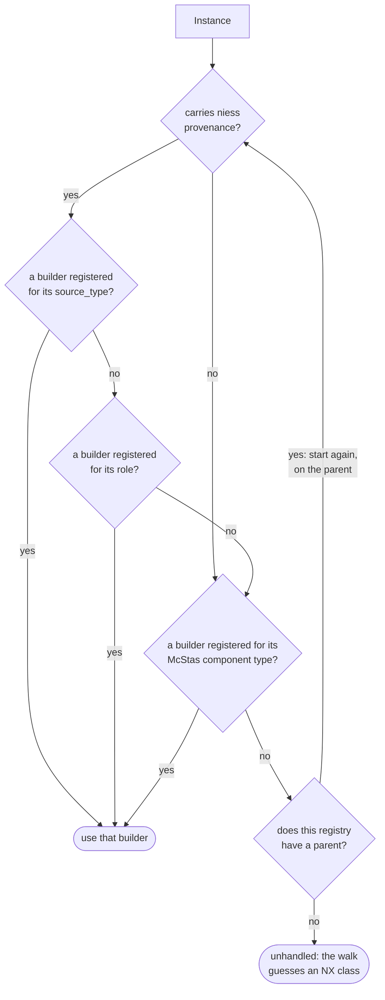

# Write NeXus translators

Reach for this when the default conversion is not good enough:

- a component came out as `NXcoordinate_system` when it should be a real class;
- niess has never heard of the component type;
- several McStas instances are physically one device and belong in one NeXus group.

A translator is a function. A registry is where you put it.

## How a translator is chosen

For each instance, the registry resolves a translator through three tiers, most
specific first:



Each decision asks whether *this* registry has a builder registered under that key --
not merely whether the instance has such a key. An instance whose `source_type` no one
has registered a builder for simply falls through to the next tier.

The first two tiers read the provenance metadata niess attaches when it builds a
component, so they can distinguish two instances of the same McStas type by what niess
thinks they are. An instance without provenance -- anything from a `.instr` niess did
not build -- skips both and is matched on its McStas component type alone.

A parent is consulted only once all three of a registry's own tiers have missed, and it
then repeats all three itself. That is what "the more specific registry wins outright"
means: a child's McStas-type builder beats a parent's `source_type` builder.

!!! note "`None` means two different things"

    A registry returning no translator means *unhandled*, and the walk falls back to
    guessing an `NX` class. A translator that runs and returns `None` means
    *suppress* — emit nothing at all. That distinction is what makes grouping possible.

## Writing one

Register on your own registry, never on the shared default:

```python
--8<-- "custom_translator.py:registry"
```

The translator receives a `Translation` and returns a component body. What
`Translation` gives you:

| | |
| --- | --- |
| `t.name`, `t.type_name` | the instance's name and McStas component type |
| `t.parameter(name, default, dtype)` | a parameter's **value**, when you need to compute with it |
| `t.parameter_node(name, source, dtype, attrs)` | a parameter as a **node** — a dataset if constant, a link if run-time |
| `t.defines(name)` | whether the component defines a parameter at all |
| `t.provenance` | what niess recorded about the source object |
| `t.instr` | the whole instrument, for translators that must look at siblings |
| `t.siblings_in_group()` | the other instances sharing this one's `nexus_group_id` |

Prefer `parameter_node` for anything a user can drive at run time; it makes the
literal-or-link decision for you. Use `parameter` only for values you need in Python.

Build children with `dataset`, `group` and `stream`, all importable from `niess.nexus`.

`component_body` also takes a `name`, which overrides the group's name — by default the
McStas instance's. Use it where that name is an artefact of how the instrument was
built: a composite split across several instances should appear under the name of the
thing itself, not `thing_slit_0`. Placements referring to the instance still resolve;
the emitted path follows the name you chose.

## Using it

Pass the registry per conversion:

```python
--8<-- "custom_translator.py:use"
```

Because your registry extends the default rather than mutating it, the same instrument
still converts the ordinary way when you do not pass it. That isolation is deliberate:
`Detector_tubes` is not a BIFROST-only component, and BIFROST's translator bakes in ICD
pixel numbering and its own Kafka topic. Registering that globally would silently corrupt
every other instrument's detectors.

## Many instances, one NeXus group

A device built from several McStas components — a multi-opening chopper, a detector
bank — collapses using the *role* tier. When building the instrument, tag each instance:

```python
add_niess_metadata(instance, self, role='nexus-group-primary',
                   extra={'nexus_group_id': 'chopper_pack', 'nexus_group_index': 0})
```

giving one instance the `primary` role and the rest `member`. Then register both roles:

```python
@MY_REGISTRY.register_role('nexus-group-member')
def suppress(t):
    return None            # emit nothing; this instance is folded into the primary


@MY_REGISTRY.register_role('nexus-group-primary')
def merged(t):
    siblings = t.siblings_in_group()   # ordered by nexus_group_index, not by position
    ...
    return component_body('NXdisk_chopper', children)
```

Tag by explicit role rather than relying on declaration order — `siblings_in_group()`
sorts by `nexus_group_index`, so the merged node is stable even if the instances move.

Give the merged node the object's own name with `component_body(..., name=...)`, so the
file describes the device rather than the components it was split across.

Suppressed instances are still recorded internally, so a later component placed
relative to one still resolves its transformation chain; the walk warns if that
happens, because the emitted `depends_on` will point at a group that is not written.

## Streams

Never hard-code a stream module in a translator. Call `resolve_stream(t, default=...)`,
which honours the instrument's own choice first and falls back to your default only if
it made none. See [choosing how a monitor streams](nexus-structure.md#choosing-how-a-monitor-streams).

## Testing

`tests/test_nexus_registry.py` shows the two useful shapes: a `FakeInstance` stub for
asserting which tier wins, and an end-to-end conversion parametrised over the registry
choice so the difference the registry makes is visible in the output.
