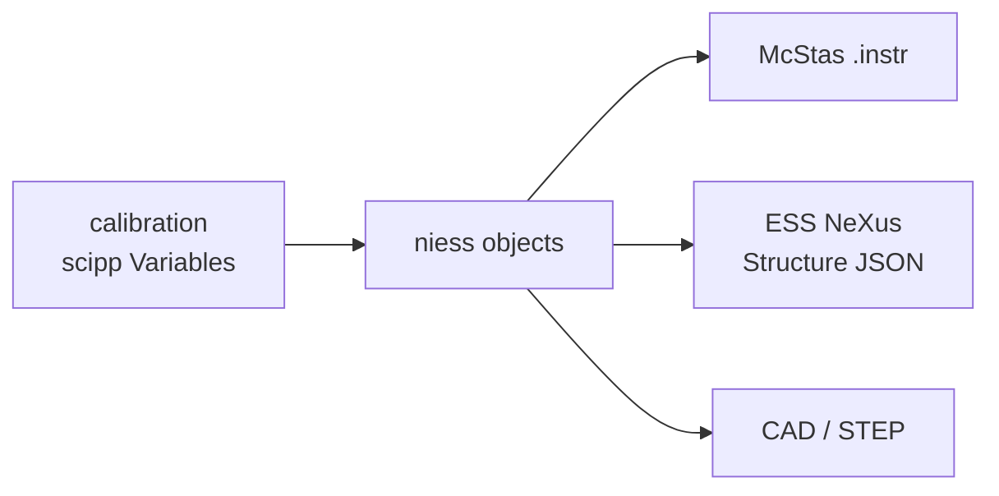

# niess

Neutron instruments of the European Spallation Source, described once as calibrated
Python objects, and emitted as whatever a downstream tool needs.

A McStas `.instr` file is a flat list of numbers. It says a guide is 2 metres long and
sits 1.5 metres from the moderator, but not that the 1.5 came from a survey, nor how to
move the guide without editing three other lines. It also says nothing a NeXus file
needs. niess keeps the *calibration* — measured quantities with units, positions
chained rather than repeated — and derives the rest:



## Install

```console
pip install niess
```

## Two ways in

<div class="grid cards" markdown>

- **I have an instrument to describe**

    Turn a McStas model into a calibration-friendly submodule, or start a new one.

    [Translate an existing `.instr`](how-to/translate-an-instr.md) ·
    [Build a new submodule](how-to/new-instrument-submodule.md)

- **I have an instrument and need NeXus**

    Convert a niess instrument to ESS NeXus Structure JSON.

    [Produce NeXus Structure JSON](how-to/nexus-structure.md) ·
    [Write translators](how-to/custom-nexus-registry.md)

</div>

## In sixty seconds

```python
--8<-- "quickstart.py:quickstart"
```

BIFROST is the instrument that exists today; `niess.teaching` is a small worked example
written to be read, and is the subject of the guides.

## Where to go next

- [Install and first instrument](getting-started.md) — build and convert something end to end.
- [Core concepts](concepts.md) — components, sections, calibration and provenance, in one read.
- [Components](reference/components.md) — every class, and the McStas component it emits.
